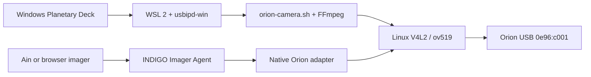

# Architecture and interface

The project has two independent camera paths. They share the Linux kernel driver and sensor conventions, but are not intended to own the camera at the same time.

## Windows panel

The existing Windows Forms panel groups target/manual brightness, connection/preview/snapshot and recording progress. The primary loop is target → preview → brightness/focus → stop preview → capture. Cold USB attachment, sensor readiness and preview startup have bounded retries. The bridge keeper remains alive while the panel is open.

Capture actions are mutually exclusive. The shell helper owns ffplay/ffmpeg lifecycle; cleanup must target only its own operation and must not kill unrelated preview programs. A failed or interrupted recording must not be reported as a complete successful file solely because bytes exist.

## INDIGO adapter

The native driver validates the exact V4L2 device, maps capture buffers and publishes one fresh sensor image per request through INDIGO's base CCD image processing. Standard Bayer metadata enables the RAW/JPEG preview path. Capture runs on a timer; abort and disconnect request cancellation and join it off the bus thread. Mount FITS-header updates queue between images rather than reallocating metadata while image processing reads it.

The sensor register is not calibrated in seconds. The adapter labels the ordinary exposure field as a frame wait and explicitly marks FITS integration time unknown. Supported modes remain 640 × 480 and 1280 × 1024, without invented binning or video-container capabilities.

## Evidence and boundaries

The Linux host used for source cleanup cannot render or exercise the Windows Forms/WSLg path. Keep parser/contract, mocked process tests, recorded Windows hardware tests and current Pi hardware tests distinct in documentation and releases.
